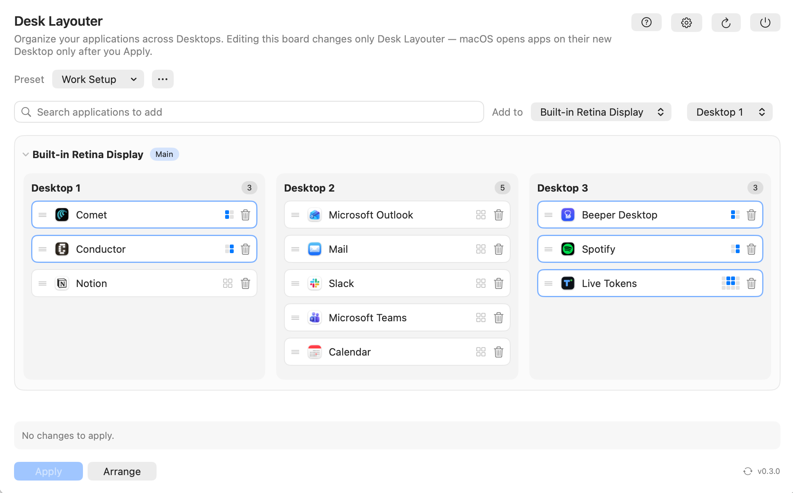

# Desk Layouter



Desk Layouter puts your apps back where they belong. Declare which Desktop (Space)
each application opens on, and where on the screen it sits, then let macOS enforce
it at every launch and login. No more dragging windows into place every morning.

It lives in your menu bar and stays out of your way. Look for this icon:


## Install

1. Download the latest **`.dmg`** from the [releases page](https://github.com/Taimonania/desk-layouter/releases/latest).
   (A `.zip` is also available if you prefer.)
2. Open the `.dmg` and drag **Desk Layouter** into your **Applications** folder.
3. Launch it from Applications or Spotlight.

Desk Layouter updates itself automatically; you can also check for updates any time
from **Settings**.

**Requirements:** macOS 13 (Ventura) or newer, on Apple Silicon or Intel Macs.

## Permissions

To position windows for you, Desk Layouter asks for **Accessibility** access the first
time you use it. Grant it in **System Settings → Privacy & Security → Accessibility**.
When you **Apply** your layout, macOS briefly restarts the Dock so the changes take
effect; a quick flicker of the Dock and menu bar is expected.

## How it works

- **Assign apps to Desktops.** Search for an application and add it to a Desktop on any
  display. That's an *Assignment*: a rule for where the app should open.
- **Apply.** Click **Apply** to write your assignments into macOS. From then on, macOS
  opens each app on its assigned Desktop at launch and at login. Desk Layouter doesn't
  need to be running to keep it that way.
- **Arrange (optional).** Give an app a *Layout* to also control *where on the screen* it
  sits (halves, thirds, and so on), then click **Arrange** to snap open windows into place.
- **Presets.** Save whole setups, such as a "Work" board and a "Home" board, and switch
  between them whenever your context changes.

## Get started

1. Install and launch Desk Layouter (see above).
2. Click the menu-bar icon to open the editor.
3. Search for your apps and add each one to the Desktop you want it on.
4. Click **Apply**. Your apps will now open there from now on.
5. (Optional) Set a Layout for an app and click **Arrange** to position its window.

## Security & updates

Desk Layouter is a universal build for Apple Silicon and Intel Macs, running on macOS 13
(Ventura) or newer. It's signed with a Developer ID identity and notarized by Apple, so it
opens without Gatekeeper warnings and keeps its Accessibility grant across updates. Updates
are delivered as EdDSA-signed archives, and the app verifies each update's signature before
installing it.

## Support

[Report a problem on GitHub](https://github.com/Taimonania/desk-layouter/issues/new).
Please include your Desk Layouter version, macOS version, expected behavior, and actual
behavior. The in-app Settings action opens the same GitHub issue path with these details
prefilled.

## Building from source

Desk Layouter requires macOS 13 or newer and the Swift toolchain.

```sh
make build
make run
make test
make test-desktop-placement
```

The application bundle is written to `.build/Desk Layouter.app`. Desk Layouter runs as a
menu-bar-only app; launching it opens the editor window automatically, and clicking its
menu-bar icon opens or focuses that window. Closing the editor window leaves the app running.

`make test` runs the assignment planner at its pure data boundary without reading or
writing the live macOS Desktop store.

`make test-desktop-placement` temporarily applies an Assignment to a disposable app,
launches it, and verifies its actual Desktop. The probe restores `app-bindings`, reapplies
that original snapshot to the current session, returns to the original active Desktop, and
removes probe processes even when it fails.
